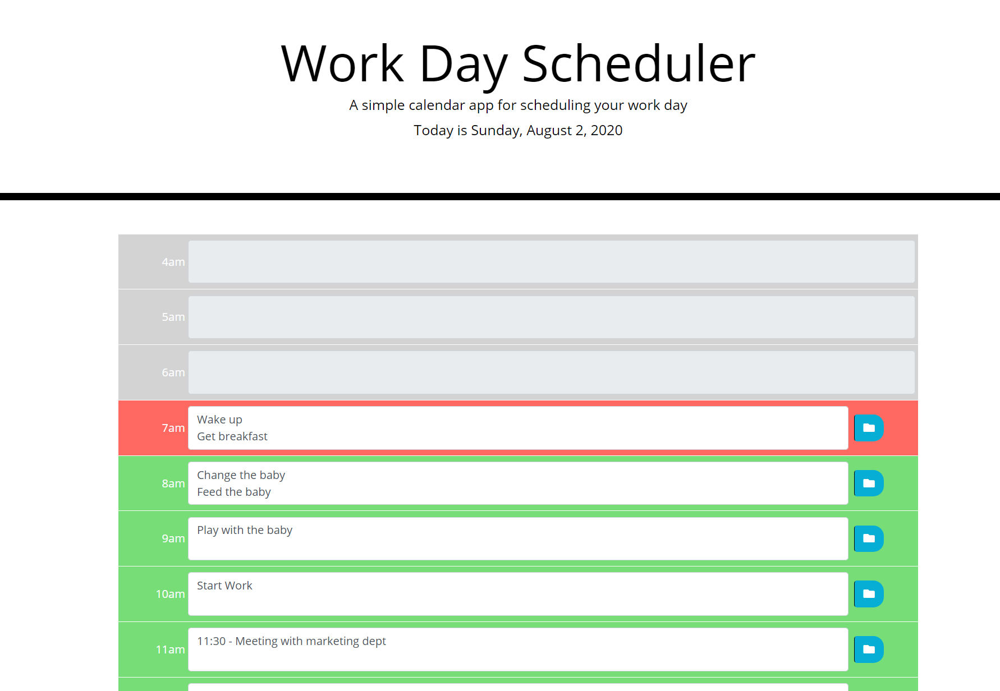
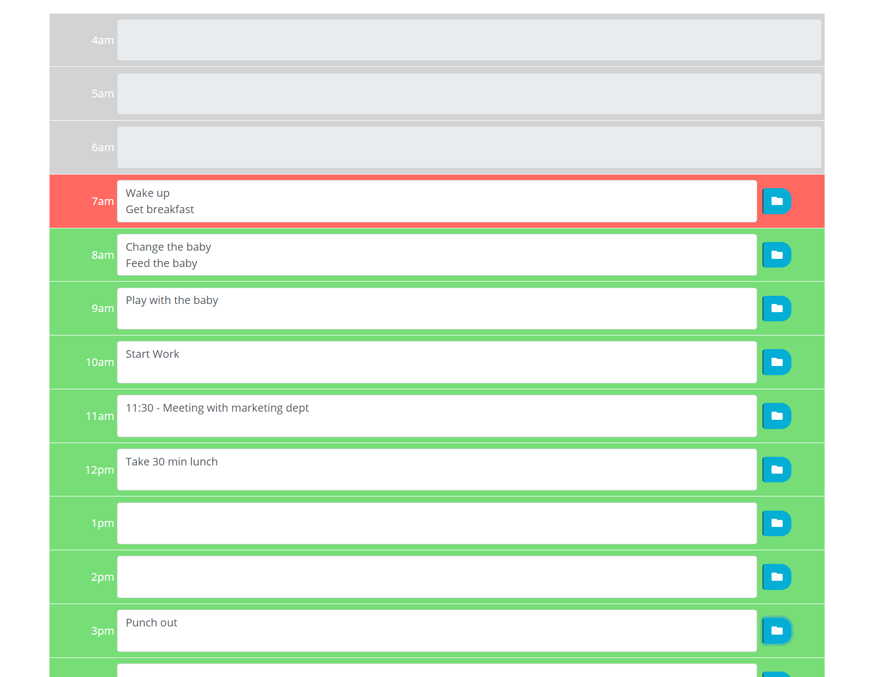
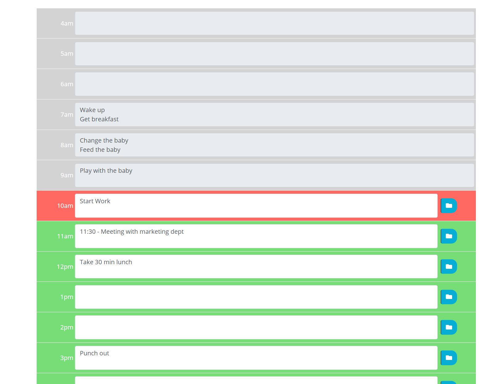
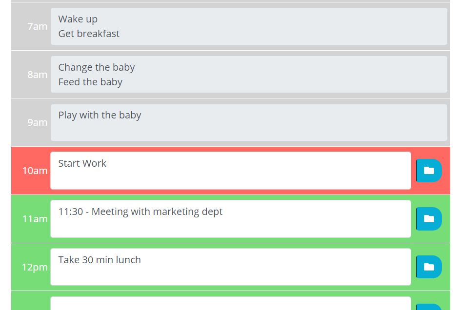
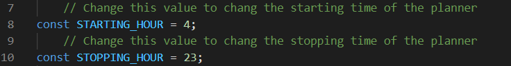

# Plan your day in style!
## Day Planner

This simple day planner can help you get organized by saving your hour by hour schedule for you.  Just enter the info you want to save into the hour slot, and click save.  Its that easy!  The planner will even wipe clean for you each new day so you can plan another amazing day.

## Come check out the deployed version here
https://jbaxter91.github.io/day-planner/index.html

## Day Planner

Look at all the space you can save into this thing!

## Day Planner

As you can see you can even see things that are now past plans.  Because they are in the past, they will not be editable so make sure you get the most out of life and plan ahead.

## Responsive Design

This program is beautiful and responsive!  Built to adapt to any screen size!

## Variable Time Adjustment
 
Want more flexability with your hours?  Well look no further, the hours are easy to change by simply adjusting the starting and stopping value.  **Set these value from 0-23**